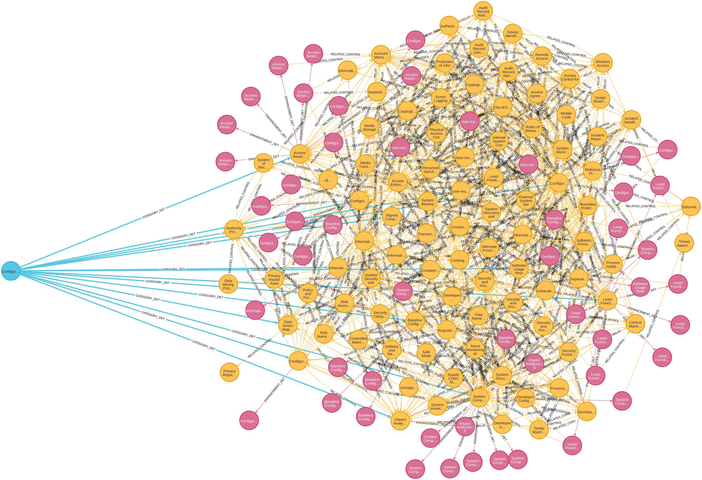

# NIST_graph

## Required Tools:  Docker and Python3.10

### prepare a new environments for python (root: nist_Grap directory):
### python3 -m venv venv
### source venv/bin/activate
### pip3 install -r requirements.txt

# INSTALL AND LOAD XLSX FILE
## docker
### ------- please change "__your-user__" label with a real value
1. sudo docker run -d --publish=7474:7474 --publish=7687:7687 --env=NEO4J_AUTH=none --volume=/home/__your-user__/dockerback/dock_NIST/data:/data neo4j

## loading NIST file
### To load file into docker execute: 
2. python3 main.py

# Exploring graph database (no user and password)
http://0.0.0.0:7474/browser/   or http://localhost:7474/browser/

# Review complete schema - Neo4j Command: 
call db.schema.visualization()  

# Reviewing Configuration Management (CM) + Controls:
MATCH (c:Category {ID:'CM'})-[rd:CATEGORY_DET]->(cd:Control)  
RETURN c, rd, cd  

  

# Reviewing Configuration Management (CM) + Control + Control Enhacement: 
MATCH (c:Category {ID:'CM'})-[rd:CATEGORY_DET]->(cd:Control)  
OPTIONAL MATCH (cd)-[rp:ENHACEMENT_DET]->(cdp:ControlEnhacement)  
RETURN c, rd, cd  
        , rp, cdp  

  

# Reviewing Configuration Management (CM) + Control + Control Enhacement -> Related Controls: 
MATCH (c:Category {ID:'CM'})-[rd:CATEGORY_DET]->(cd:Control)  
OPTIONAL MATCH (cd)-[rp:ENHACEMENT_DET]->(cdp:ControlEnhacement)  
OPTIONAL MATCH (cdp)-[rcp:RELATED_CONTROL]->(cd2:Control)  
RETURN c, rd, cd, rp, cdp, rcp, cd2  

  

# Reviewing Configuration Management (CM) - complete dependencies: 
MATCH (c:Category {ID:'CM'})-[rd:CATEGORY_DET]->(cd:Control)  
OPTIONAL MATCH (cd)-[rp:ENHACEMENT_DET]->(cdp:ControlEnhacement)  
OPTIONAL MATCH (cd)-[rcdr:RELATED_CONTROL]->(cdr:Control)  
OPTIONAL MATCH (cdp)-[rcp:RELATED_CONTROL]->(cd2:Control)  
RETURN c, rd, cd, rp, cdp  
        , rcdr, cdr  
        , rcp, cd2  

# Categories
## ID	    Name 	                                    Elements

"AC"	"Access Control"	                            25

"AT"	"Awareness and Training "	                     6

"AU"	"Audit and Accountability"	                    16

"CA"	"Security Assessment and Authorization "	    9

"CM"	"Configuration Management"	                    14

"CP"	"Contingency Planning"	                            13

"IA"	"Identification and Authentication"	            12

"IP"	"Information Processing"	                    0

"IR"	"Incident Response"	                            10

"MA"	"Maintenance"	                                    7

"MP"	"Media Protection"	                            8

"PE"	"Physical and Environmental Protection "	    23

"PL"	"Planning"	                                    11

"PM"	"Program Management"	                            32

"PS"	"Personnel Security"	                            9

"PT"	"Personally Identifiable"	                    8

"RA"	"Vulnerability Scanning"	                    10

"RM"	"Risk Management"	                            0

"SA"	"System and Service Acquisition"	            23

"SC"	"System and Communications Protection "	            51

"SI"	"System and Information Integrity"	            23

"SR"	"Supply Chain Risk Management"	                    12
